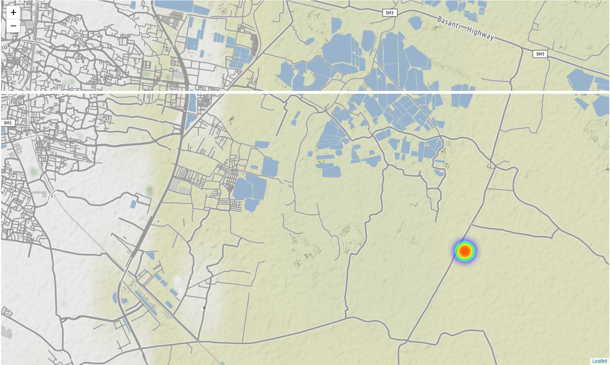

# Raspberry-Pi-GPS-Camera-with-YOLO-V3
A project that involves a Raspberry Pi based GPS Camera, which also takes magnetometer and barometer readings, sends the image and readings to server, runs YOLO Object detection on the image, stores the detection and reading in sqlite db. A jupyter notebook is included to visualize the detected objects on a map. 

First step : Go to config, and run download_weights.sh

## **Raspberry Pi GPS Camera**

Hook up the GPS Module following this :
```
2->GPS VCC
6->GPS GND
8->GPS RX
10->GPS TX
```

Put the gpspicam.py in your raspberry pi.

NEO 7M is my GPS module, and I have followed this for setting it up :  https://medium.com/@DefCon_007/using-a-gps-module-neo-7m-with-raspberry-pi-3-45100bc0bb41

Then get this python library : https://github.com/wadda/gps3

Once done, if you get an output in gpsmon, then run ```gpsRun.sh```, after that run ```gpstest.py``` to see if you can get latitude and longitude.

If you get the output, then you are ready :D

**change line 35 in gpspicam.py to the local address of your computer where YOLO will be running**

Run ipYOLO.py in your computer, then run gpspicam.py in your raspberry pi.


## **Raspberry Pi GPS Camera with Barometer and Magnetometer**

Barometer and Magnetometer are used to get altitude and direction, so it will help you get accurate location of a detected object in the image, but I have not used any algorithm for that, I have just taken the reading and stored it.

Put the zmqpicam.py in your raspberry pi.

Then follow this link : https://www.instructables.com/id/Raspberry-PI-Multiple-I2c-Devices/

Add another i2c channel to your raspberry pi. Just i2c bus 3, bus 4 isn't required.

Now, since I'm using QMC5883L 3-Axis Magnetic Sensor, I have used this library : https://github.com/RigacciOrg/py-qmc5883l

**Important detail:**
Since we have added an extra i2c bus, we need to change one of the modules to use the new bus, so instead of installing the above
qmc library, I have taken the __init__.py file here https://github.com/RigacciOrg/py-qmc5883l/blob/master/py_qmc5883l/__init__.py
and I have put it a folder named 'py_qmc5883l'. The folder is placed in the same directory as the zmqpicam.py. I have changed line 27 
in __init__.py to DFLT_BUS = 3.

BMP280 is my barometer, so this the library I have used for it : https://github.com/pimoroni/bmp280-python

I am using NEO 7M as my GPS module.
To setup gps, I have followed this : https://medium.com/@DefCon_007/using-a-gps-module-neo-7m-with-raspberry-pi-3-45100bc0bb41

And this is the python library that I have used to read gps data : https://github.com/wadda/gps3

I'll admit, getting the GPS to work is really difficult.

Once done, hook up all the modules by following this : 
```
1->QMC VCC
2->GPS VCC
3->QMC SDA
4->BMP VCC
5->QMC SCL
6->GPS GND
8->GPS RX
9->BMP GND
10->GPS TX
14->QMC GND
16->BMP SDA
18->BMP SCL
```
Pinout of Raspberry Pi : 


Once done, run zmqpicam.py and see if it displays GPS data or FPS. If GPS isn't receiving any signal, the program uses the default 
values given in line 134 and 135. If GPS receives any signal, it will print the latitude and longitude.

**Test each module separately before running the zmqpicam.py**

**I have included the test files ([module-name]test.py). Also run gpsRun.sh everytime you restart pi**

Once the raspberry pi side is done, now it is time for the actual test !

**change line 35 in zmqpicam.py to the local address of your computer where YOLO will be running**

Run ipYOLO.py on your computer, then run zmqpicam.py on the Raspberry pi. If you see values being printed on your computer, then voila ! 
your project is successfully running ! :D

## **Rest of the details**

You can exit the ipYOLO.py by pressing 'q'. 

To visualize the detections, run sql2map.ipynb, change the label to whatever label you wish to see from the db.

Use this to view your sqlite table :  https://sqlitebrowser.org/

I got this output on the map : 


